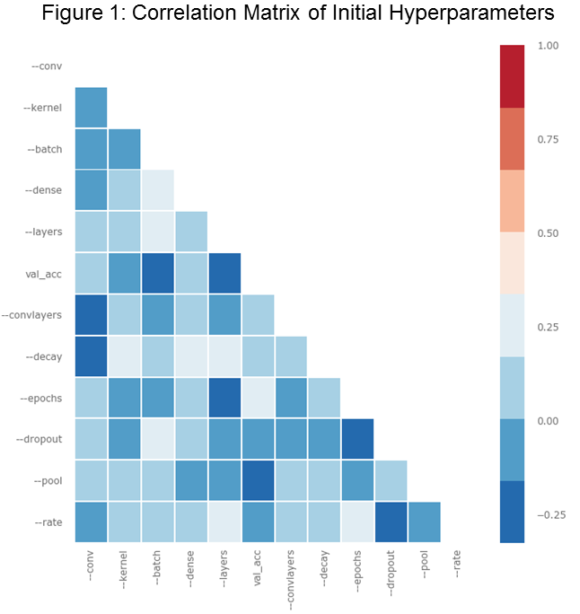

# MNIST Digit Classification System
MNIST Digit Classification using Convolutional Neural Networks

This project presents a system for training, tuning hyperparameters, and evaluating a Convolutional Neural Network for MNIST digit classification.

# Best Model and Process to Reproduce

My best model had (accuracy, categorical cross-entropy losses) of: 

Training: (99.763, 0.00686)
Validation: (99.35, 0.0262)
Testing: (98.7, 0.0435)

## Steps to Reproduce

First, ensure you are using python 3.6. Then, clone the repository and set up a python virtual environment (using venv, see this link: https://packaging.python.org/guides/installing-using-pip-and-virtualenv/). 
The full list of dependencies for the project are laid out in the requirements.txt file. To install these requirements use the following command:

    pip install -r requirements.txt 

Ensure that you are in the main directory of the project in order to access requirements.txt
Next, ensure you are in the project directory ("MNIST_Prediction") and follow the commands below.

The exact commands to reproduce this result are:

    python MNIST download Data
    python MNIST train Data Optimal optimized_model.txt
    python MNIST test Results Data Optimal

This will produce two files, one is "Model_Output/Optimal.txt." This contains the training and validation accuracy. 
The second file is "Results.txt" which contains the Testing accuracy. To inspect and alter the model architecture, please see the Models/optimized_model.txt file and the Model Specification markdown file for instructions.

# How did I arrive at this model?

First I made some model architecture decisions based upon the structure of this problem. I decided upon a model that consists of convolutional layers at the beginning with max pooling and dropout for regularization. Then, a series of fully connected layers (with dropout in the final connected layer) and a size 10 softmax layer for output. I used the softmax layer because we are interested in probabilities for each possible digit.

With this model architecture, I used Talos to do a random grid search over hyperparameters to get a feel for how these impact validation set accuracy. I immediately found that having more than one convolutional layer, and a filter size of at least 16 was necessary for accurate output. In addition, I found that having at least 128 fully connected layers was necessary for training set accuracy. The best performing hyperparameters for this search consisted of learning rate set at 0.001 and batch size 1000 so these were fixed for my second hyperparameter search. Another observation I found was that there were no instances of overfitting (no instances of training set accuracy increasing with decreasing validation set accuracy). This implied that more complicated networks could be attempted to achieve better training accuracy.

!(imgs/Figure_2.png)

The second round (Figures 3 and 4) demonstrated that having a large number of epochs (at least 10) drives better model performance. In addition, having more fully connected layers and convolutional layers improved performance. Lastly I found that low dropout rate and small max pooling size was correlated with validation set accuracy, implying that the model was not prone to overfitting.

!(imgs/Figure_3.png)

!(imgs/Figure_4.png)

Putting all of these results together I arrived at my first successful model architecture. This consisted of two layers of 32 convolutional filters (3x3 kernels) along with (2x2) max pooling and 25% dropout. This was then flattened and fed to two 256 neuron fully connected layers with 25% dropout again, and then the softmax. 

I found that reducing the dropout further did not cause overfitting. In addition, I found that adding a second set of convolutional filters improved training set accuracy and dev set accuracy. This is how I arrived at my second model. Finally, to see if performance could be pushed further, I increased the number of epochs to 15 and saw no reduction in dev set performance, implying that the model was well regularized. This was my final model!

# Full Instructions for MNIST Classification

The MNIST handwritten dataset is a popular benchmark for image classification algorithms, especially CNN's. The purpose of this project is to have an enclosed system for beginners to experiment with CNN architectures on the MNIST dataset without doing any extra work. The project includes commands for downloading the data, parsing a CNN model from a text file and training the CNN, Hyperparameter exploration using Talos, and Evaluating proposed CNN's on the test set and serializing output models.

# Downloading Data

The data is downloaded directly from this link: "http://yann.lecun.com/exdb/mnist/" To do so, please use the following command

    python MNIST download <dataset-dir>
  
The argument specifies the name of the directory to download the data to. Please keep this consistent throughout all commands of the project. The datasets will be downloaded as gzipped tarballs to save space on disk. They will be parsed when training/testing the model.

# Training a Model

In order to train, a model specified using our model file format. Please use the following command:

    python MNIST train <dataset-dir> <model-name> <model-description-file> [-s SPLIT]

Here, \<dataset-dir> should match the name used in the downloading step. \<model-name> will be the identifier used for the model for any output files. \<model-description-file> should be the filename of your specified model file (Please do not include any path information, just the file name).

This command will output a serialized Keras model file along with a simple text file with accuracy metrics on the train and validation sets. The -s argument can be used to alter the proportion of data sent to the training set (Default: 0.9). 

# Testing a Model

    python MNIST test <comparison-name> <dataset-dir> <model-names>

Again, \<dataset-dir> should be the same as the previous commands. \<comparison-name> is an identifier used to produce the results, and \<model-names> is a comma separated list of model names that had been trained using the train command. The output of this command is a single text file with results for all of the models on the testing set (includes categorical-cross entropy loss and prediction accuracy).

# Exploring Hyperparameters

    python MNIST explore <dataset-dir> <model-name> [-f FILE] [-z SIZE] [-c CONV] [-v CLAYERS] [-r RATE] [-b BATCH] [-l LAYERS] [-o OPTIMIZER] [-d DROPOUT] [-k KERNEL] [-p POOL] [-y DECAY] [-m MOMENTUM] [-e EPOCHS]

One more time, \<dataset-dir> should be the same as in any other command. \<model-name> is an identifer used to create an output directory for the results of the hyperparameter scan. The definitions of all of the optional parameters that can be tested are as follows:

    -r, --rate RATE                 Comma separated list of learning rates to explore [default: 0.001]
    -b, --batch BATCH               Comma separated list of batch sizes to explore [default: 1000]
    -l, --layers LAYERS             Comma separated list of number of fully connected layers to explore [default: 1,2]
    -c, --conv CONV                 Comma separated list of number of convolutional filters to explore[default: 16,32]
    -o, --opt OPTIMIZER             Comma separated list of optimizers to try [default: Adam,RMSProp]
    -d, --dropout DROPOUT           Comma separated list of dropout percentage [default: 0.1,0.25]
    -e, --epochs EPOCHS             Comma separated list of epoch sizes for training [default: 5,10,15]
    -z, --dense SIZE                Comma separated list of neurons in output of hidden layer [default: 32,64]
    -k, --kernel KERNEL             Comma separated list of kernel sizes for convolutional layers [default: 3,5]
    -p, --pool POOL                 Comma separated list of sizes for max pooling layer [default: 2,3]
    -y, --decay DECAY               Comma separated list of decay values for optimization [default: 0.0001]
    -m, --mom MOMENTUM              Comma separated list of momentum values for optimization [default: 0.25,0.5,0.75]
    -v, --convlayers CLAYERS        Comma separated list of number of convolutions before max pooling [default: 1,2]

For this exploration the architecture was fixed at Convolutional layers first, followed by Maxpooling and dropout, and then flattening. Finally fully connected layers and softmax output with 10 categories (one per digit).
